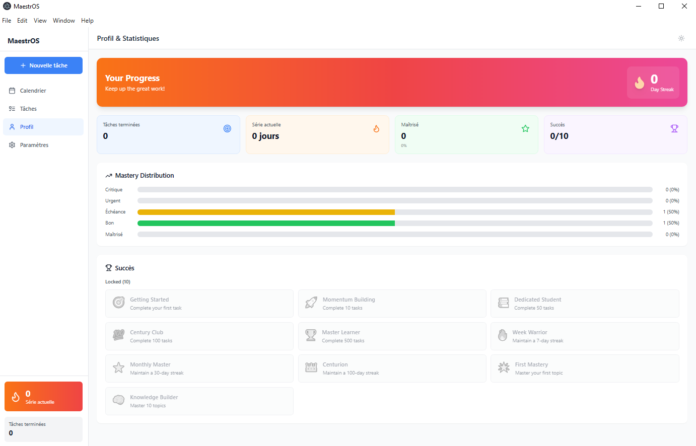
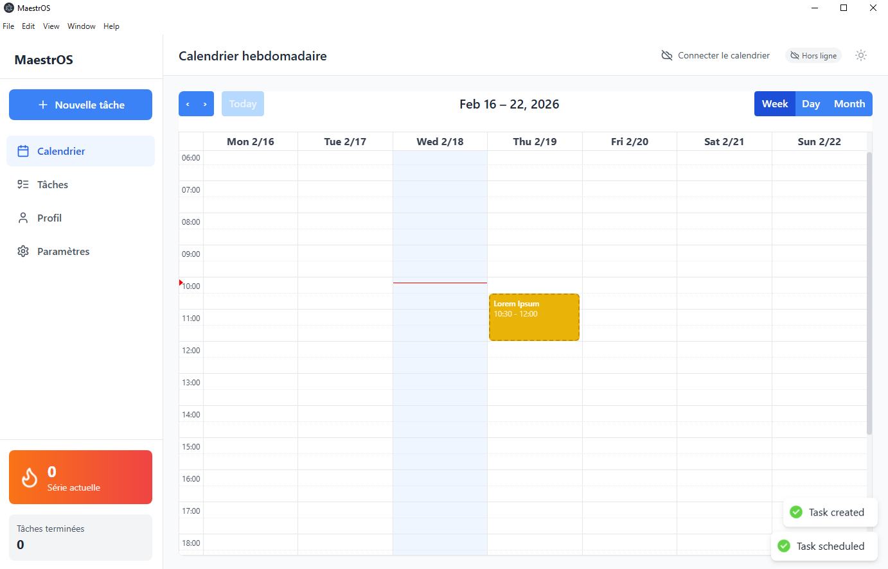

# MaestrOS

[](https://github.com/0xLysandre/MaestrOS/releases/latest)
[](LICENSE)
[]()
[]()

A smart study planner for French students featuring review scheduling, Google Calendar integration, and gamification. Perfect for CPGE, BTS, Licence, Médecine, Droit, and any study program.

## Screenshots






---

## Download & Install

### Windows

1. Download `MaestrOS.Setup.exe` from the [latest release](../../releases/latest)
2. Run the installer
3. Launch "MaestrOS" from your Start Menu

### macOS

1. Download `MaestrOS.dmg` from the [latest release](../../releases/latest)
2. Open the DMG and drag the app to Applications
3. **Important**: Run this command in Terminal to allow the app:
   ```bash
   xattr -cr /Applications/MaestrOS.app
   ```
4. Launch from Applications

### Linux

1. Download `MaestrOS.AppImage` from the [latest release](../../releases/latest)
2. Make it executable: `chmod +x MaestrOS.AppImage`
3. Run it: `./MaestrOS.AppImage`

**That's it!** The app works fully offline. Google Calendar sync is optional.

---

## Features

### Smart Task Management

- **5-Level Mastery System**: Track learning progress from level 1 (new topic) to level 5 (mastered)
- **Review Scheduling**: Tasks auto-reschedule using progressive intervals that grow with your mastery
- **One-Click Scheduling**: "Create & Schedule" button finds the best time slot automatically

### Calendar Integration

- **Google Calendar Sync**: See all your events in one place (optional)
- **Weekly View**: Interactive calendar with drag-and-drop
- **Conflict Detection**: Smart scheduling avoids double-booking

### Gamification

- **Daily Streaks**: Build consistency with streak tracking
- **Achievements**: Unlock badges for reaching milestones
- **Progress Stats**: Track completed tasks and mastery progress

### Additional Features

- **Dark/Light Mode**: Choose your preferred theme
- **French & English**: Full bilingual support
- **Export/Import**: Backup your data as JSON
- **PDF Links**: Attach learning resources to tasks
- **Tags & Notes**: Organize tasks with custom metadata
- **Offline Support**: Works without internet
- **Auto-Updates**: Get notified when new versions are available

---

## Quick Start Guide

### Creating Tasks

1. Click **"Nouvelle tâche"** in the sidebar
2. Fill in title, description, and mastery level
3. Click **"Créer & Planifier"** to auto-schedule, or just **"Créer"**

### Mastery Levels

| Level | Default Name | Review Interval |
| ----- | ------------ | --------------- |
| 1     | Critique     | 1 day           |
| 2     | Urgent       | 3 days          |
| 3     | Échéance   | 7 days          |
| 4     | Bon          | 7 days          |
| 5     | Maîtrisé   | 21 days         |

*Intervals grow progressively with consecutive successful reviews (1 → 3 → 7 → 14 → 21 → 30 → 45 → 60+ days)*

### Completing Tasks

- Click a task to mark complete
- Choose how it went: "J'ai compris !", "À revoir", or "Garder le niveau"
- Next review date calculates automatically based on your response

---

## Optional: Google Calendar Setup

To sync with Google Calendar, you need to create your own OAuth credentials:

### Step 1: Create a Google Cloud Project

1. Go to [Google Cloud Console](https://console.cloud.google.com)
2. Click **Select a project** → **New Project**
3. Name it (e.g., "MaestrOS") and click **Create**

### Step 2: Enable the Calendar API

1. Go to **APIs & Services** → **Library**
2. Search for "Google Calendar API"
3. Click **Enable**

### Step 3: Create OAuth Credentials

1. Go to **APIs & Services** → **Credentials**
2. Click **Create Credentials** → **OAuth client ID**
3. If prompted, configure the consent screen first:
   - Choose **External**
   - Fill in app name: "MaestrOS"
   - Add your email as a test user
4. For application type, select **Desktop app**
5. Click **Create** and copy the **Client ID** and **Client Secret**

### Step 4: Add Credentials to MaestrOS

1. Open MaestrOS and go to **Settings**
2. Scroll to **Google API Configuration**
3. Paste your Client ID and Client Secret
4. Click **Save Changes**
5. Go to **Google Calendar** section and click **Connect**

---

## For Developers

### Prerequisites

- Node.js 18+
- npm

### Development Setup

```bash
# Clone the repository
git clone https://github.com/0xLysandre/MaestrOS.git
cd MaestrOS

# Install dependencies
npm install

# Start development server
npm run dev
```

#### NixOS Users

```bash
./dev.sh
```

### Environment Variables (Optional)

Create a `.env` file for development:

```env
GOOGLE_CLIENT_ID=your_client_id_here
GOOGLE_CLIENT_SECRET=your_client_secret_here
```

### Building

```bash
# Build for current platform
npm run package

# Build for specific platform
npm run package:win
npm run package:mac
npm run package:linux
```

### Project Structure

```
MaestrOS/
├── src/
│   ├── main/           # Electron main process
│   │   ├── database/   # SQLite database
│   │   └── services/   # Business logic
│   ├── renderer/       # React frontend
│   │   ├── components/ # UI components
│   │   ├── i18n/       # Translations (FR/EN)
│   │   └── store/      # Zustand state
│   └── shared/         # Shared types & constants
├── .github/
│   └── workflows/      # CI/CD automation
└── package.json
```

### Tech Stack

| Layer     | Technology              |
| --------- | ----------------------- |
| Framework | Electron 38             |
| Frontend  | React 18 + TypeScript   |
| Styling   | Tailwind CSS            |
| State     | Zustand                 |
| Database  | SQLite (better-sqlite3) |
| Calendar  | FullCalendar            |
| Updates   | electron-updater        |

---

## Contributing

Contributions are welcome! Please feel free to submit issues and pull requests.

## License

MIT License - see [LICENSE](LICENSE) for details.

---

**Built for students, by students.**
